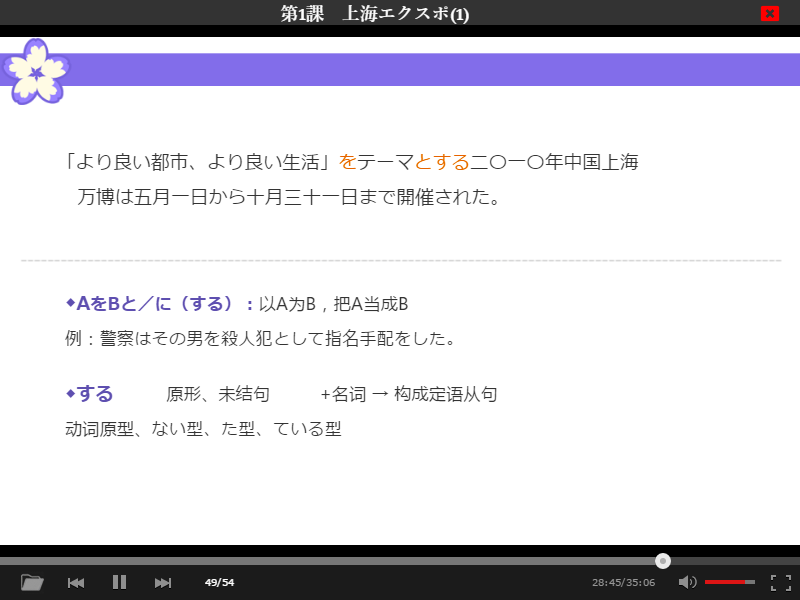

## 说明

沪江课件的专用播放器。目前是未完成版。比如，练习环节等尚未实现。

本程序不提供课件数据的解密提取办法。

注：上一版代码（已移到broswer分支）基于浏览器开发，因此设计上基于标准的DOM事件。而且界面布局是嵌入HTML页面的，布局是相对于页面内容计算的。现改为Electron框架，界面布局要与桌面窗口关联，某些设计窗体的事件需要通过remote交互。目前，代码勉强移植过来了，但还略混乱，留待以后重构。

## 编译
直接从源码运行

    npm install
    npm start

编译打包程序

    npm run build

可以在`./dist`下生成适合各操作系统的不同版本程序。
